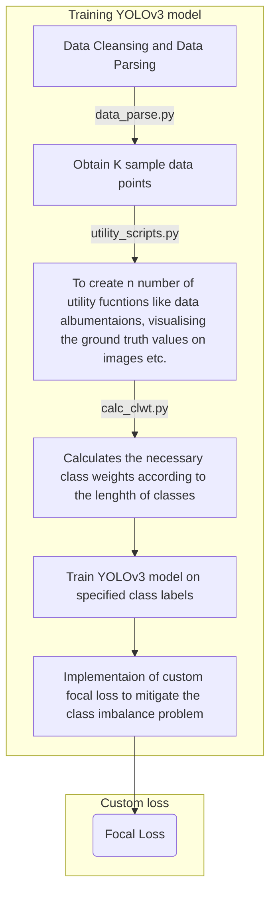

# Project: Machine-learning based tracking of anatomical structures in intubation videos
Machine learning based tracking of anatomical structures in intubation videos was carried out at the TUHH. 

# Abstract
Airway management problems and airway-related adverse events are the main causes
of anesthesia-related complications and liability for anaesthesiologists. Reliable and
personalized airway risk prediction is an essential prerequisite for safe anaesthesia as it
allows optimized individual anaesthesia planning. One factor in estimating the risk of a
specific patient scheduled for anaesthesia is the size and location of certain anatomical
landmarks which can be inspected from the intubation videos. For that purpose, videos
of intubation have been recorded and anatomical landmarks (eg. epiglottis, arytenoid
cartilage, etc.) have been labelled by medical experts. To investigate the detection of
anatomical landmarks on the images extracted from intubation videos You Only Look
Once, Version 3 (YOLOv3) model is adopted. First, the occurrence of all class labels
among the images are estimated as this aids in understanding the range of occurrences
of class labels. Second, some of the class labels (eg. food, lip, teeth, etc.) have fewer
occurrences in the images hence a class imbalance problem is encountered. To solve the
class imbalance problem the class weights of respective class labels are calculated which
are utilised in training the YOLOv3 model. Third, by adopting the YOLOv3 model
various experiments are conducted for different number of class labels. To evaluate
the performance of YOLOv3 model detection, the mean average precision is used as
evaluation metric. The class labels (eg. arytenoid cartilage, glottis, epiglottis etc) are
detected by YOLOv3 model. However the class labels (eg. food, lip, teeth, etc.) which
are having fewer occurrence in the images, detecting these class labels is a challenging
task which requires further investigation and progress

## Confidentiality Agreement
Owing to the confidentiality agreement and NDA the necessary scripts and resuts are not enclosed in the repository. But to summarise the overall work a Mermaid diagrams is desribed below

